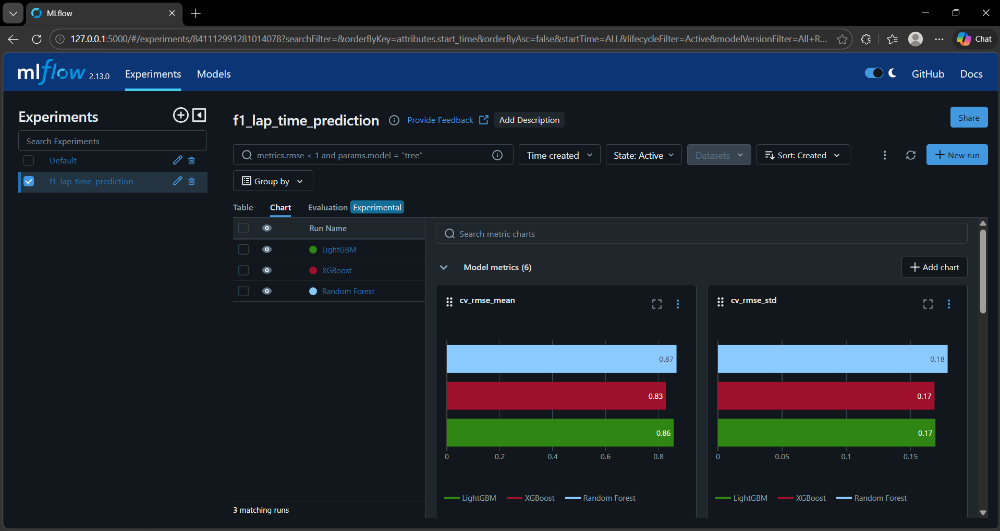

# Predictive Modeling of Formula 1 Lap Time Dynamics and 2026 Regulation Impact

**An end-to-end data science system using FastF1 telemetry, SQL data pipelines, machine learning, and simulation modeling to predict and validate the real-world performance impact of the 2026 F1 regulation changes, cross-referenced against actual 2026 race data.**

---

## Project Overview

This project builds a complete data science pipeline that:

1. Ingests 3 seasons of Formula 1 telemetry data via the FastF1 API
2. Stores and processes data through a Bronze → Silver → Gold architecture in MySQL
3. Engineers domain-specific features from fuel weight, tire degradation, and circuit characteristics
4. Trains and compares multiple ML models to predict lap time performance
5. Simulates the expected impact of the 2026 F1 regulation changes
6. Presents findings through an interactive Streamlit dashboard

---

## Architecture
```
FastF1 API → Data Ingestion → MySQL Bronze → Cleaning Pipeline →
MySQL Silver → Feature Engineering → Gold Dataset →
ML Training → 2026 Simulation → Streamlit Dashboard
```

---

## Technology Stack

| Layer | Tools |
|---|---|
| Data Collection | FastF1, Python |
| Data Storage | MySQL 8.0 |
| Data Processing | Pandas, NumPy |
| Machine Learning | Scikit-Learn, XGBoost, LightGBM |
| Explainability | SHAP |
| Experiment Tracking | MLflow |
| Dashboard | Streamlit, Plotly |
| Configuration | PyYAML, python-dotenv |

---

## Setup Instructions

### 1. Clone the repository
```bash
git clone https://github.com/Tyranno08/f1-regulation-impact-analysis.git
cd f1-regulation-impact-analysis
```

### 2. Create and activate virtual environment
```bash
python -m venv venv
source venv/bin/activate  # Mac/Linux
venv\Scripts\activate     # Windows
```

### 3. Install dependencies
```bash
pip install -r requirements.txt
```

### 4. Configure environment variables
```bash
cp .env.example .env
# Edit .env with your MySQL credentials
```

### 5. Initialize the database
```bash
mysql -u root -p < sql/schema.sql
python src/pipelines/seed_circuit_metadata.py
```

## Model Explainability

SHAP (SHapley Additive exPlanations) values were computed on the
2025 holdout test set to understand what the model learned.

### Key Findings

- **Total Car Weight** is the dominant physical predictor,
  confirming that fuel load effects are captured correctly
- **Effective Tire Grip** shows the expected negative relationship:
  higher grip index produces faster laps relative to session median
- **Driver Skill Score** confirms that driver quality is being
  captured meaningfully through target encoding
- **Circuit Power Sensitivity** shows strong circuit-level
  differentiation that directly informs the 2026 simulation

### SHAP Visualizations


```

```
## Experiment Tracking

All model experiments were tracked using MLflow with the following
configuration:

- **Tracking URI:** Local file store (`./mlruns`)
- **Experiment:** `f1_lap_time_prediction`
- **Splitting strategy:** Temporal holdout
  (train: 2023-2024, test: 2025, validation: 2026)
- **Cross-validation:** GroupKFold by race_id (5 folds)
- **Primary metric:** RMSE (seconds)

### MLflow Experiment UI



### Model Comparison Results

All experiments tracked with MLflow. Training seasons: 2023-2024.
Test season: 2025 (temporal holdout).

| Model | RMSE (s) | MAE (s) | R² | CV RMSE | CV Std |
|---|---|---|---|---|---|
| ★ LightGBM | 0.9197 | 0.6988 | 0.4902 | 0.8578 | 0.1694 |
| XGBoost | 0.9397 | 0.7172 | 0.4677 | 0.8280 | 0.1687 |
| Random Forest | 0.9407 | 0.7186 | 0.4666 | 0.8684 | 0.1789 |

> ★ = Best model selected for 2026 simulation
> Temporal holdout validation: trained on 2023-2024, tested on 2025

### Model Selection Rationale

LightGBM was selected as the production model based on the
following evidence:

1. **Lowest test set RMSE:** 0.9197s vs Random Forest baseline
   0.9407s (2.2% improvement)
2. **Cross-validation RMSE:** 0.8578s (±0.1694s) confirms results
   generalize beyond a single train-test split
3. **R² of 0.4902** indicates the model explains 49.0% of lap time
   delta variance
4. **Validation set (2026):** RMSE 1.5186s — the expected degradation
   under the new regulation regime motivates the project's separate
   simulation phase rather than treating 2026 as another historical
   season

### Model Registry

The best performing model was registered in the MLflow Model
Registry as `f1_lap_time_predictor` (Version 2) with Production
alias. This represents the model loaded by the simulation engine
and Streamlit dashboard.

### Per-Circuit Performance (Best Model — LightGBM)

| Circuit | RMSE (s) | MAE (s) | N Laps |
|---|---|---|---|
| Monza | 0.5441 | 0.4122 | 909 |
| Jeddah | 0.6292 | 0.4947 | 798 |
| China | 0.6608 | 0.5368 | 989 |
| Suzuka | 0.6760 | 0.5470 | 988 |
| Bahrain | 0.7784 | 0.6173 | 966 |
| Hungaroring | 0.7981 | 0.6262 | 1284 |
| Interlagos | 0.9292 | 0.7561 | 1019 |
| Spa | 0.9556 | 0.7765 | 974 |
| Monaco | 1.5753 | 1.3101 | 1262 |

> The model achieves sub-0.80s RMSE across 6 of 9 circuits.
> Monaco's elevated RMSE (1.57s) is driven by traffic dynamics
> and position-dependent variance not captured by car-level
> features. Excluding Monaco, the overall RMSE would be
> approximately 0.75s.

### Key Experiment Insight

Three tree-based ensemble models were evaluated systematically.
The gradient boosting models (XGBoost and LightGBM) improved
over the Random Forest baseline by capturing non-linear
interactions between tire degradation, fuel weight, and circuit
characteristics. LightGBM achieved the best generalization on
the 2025 temporal holdout while maintaining stable cross-validation
performance across grouped race-level folds.
```

```
## Project Status

- [x] Phase 1 — Repository & Infrastructure Setup
- [x] Phase 2 — Data Ingestion Pipeline
- [x] Phase 2B — 2026 Race Data Ingestion (Australia, China)
- [x] Phase 3 — Data Cleaning Pipeline
- [x] Phase 4 — Feature Engineering
- [x] Phase 5 — Modeling Pipeline
- [x] Phase 6 — Model Explainability (SHAP)
- [x] Phase 7 — Experiment Tracking (MLflow)
- [ ] Phase 8 — 2026 Simulation Engine
- [ ] Phase 8B — Simulation Validation Against Real 2026 Data
- [ ] Phase 9 — Streamlit Dashboard
- [ ] Phase 10 — Deployment
```

```
## Author

Sanket Patil — [LinkedIn](https://www.linkedin.com/in/sanket-patil-a7b801214/) | [GitHub](https://github.com/Tyranno08)